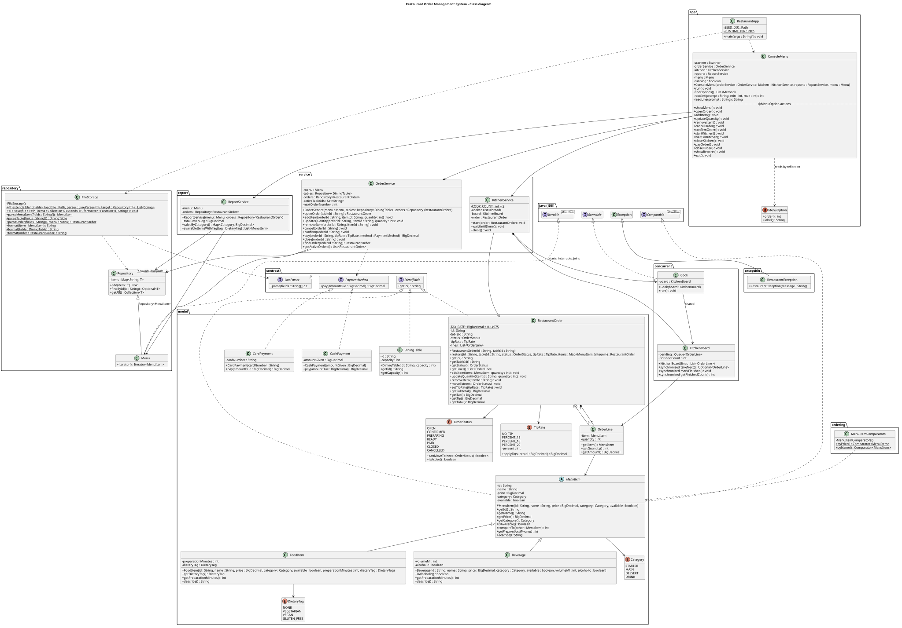

# Class diagram

## Packages

| Package | What it does |
|---|---|
| `app` | Starts the program and runs the console menu. |
| `model` | The restaurant objects: menu items, tables, orders and payments. |
| `contract` | The interfaces used by several packages. |
| `repository` | Keeps the objects by id, and reads and writes the data files. |
| `service` | Opens, changes, pays and closes the orders, and runs the kitchen. |
| `ordering` | The different ways to sort the menu items. |
| `report` | Builds the reports. |
| `concurrent` | The cook threads and the data they share. |
| `exception` | Our exception, `RestaurantException`. |

The tests are in `src/test/java` (same packages as the code they test).
